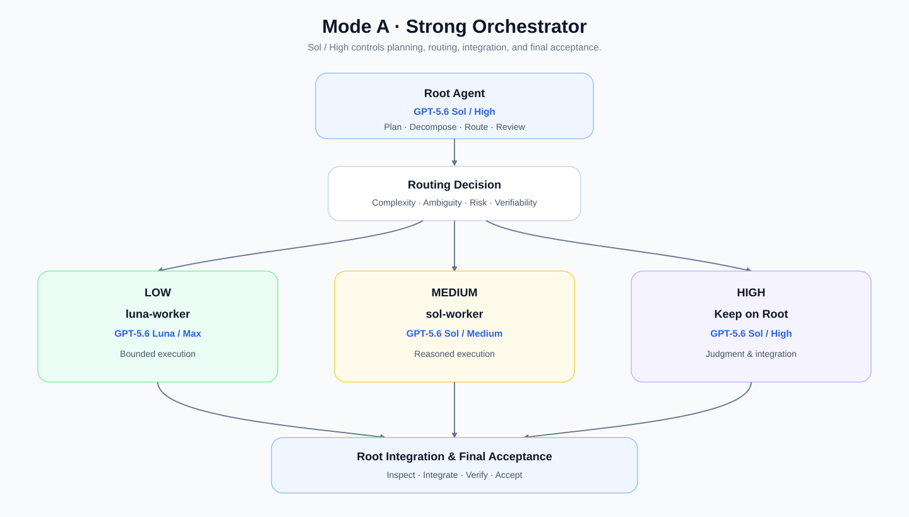
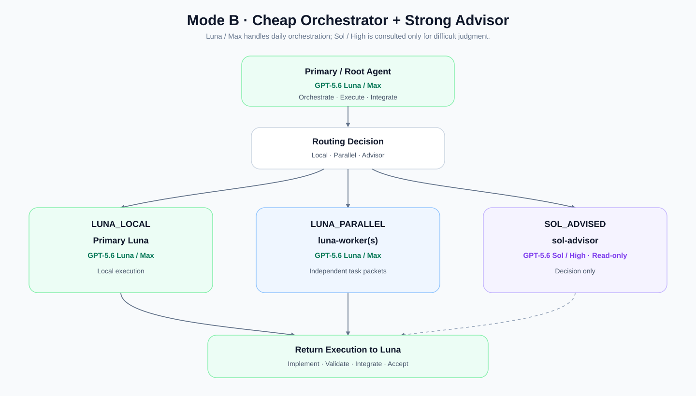

# Codex Model Routing

[简体中文](README.md) | **English**

A research baseline and reusable configuration set for **Model-Aware Orchestration** in Codex App / Codex multi-agent workflows.

This repository is not primarily about asking “which model is stronger.” Instead, it studies:

> How to use `AGENTS.md` orchestration policies to organize GPT-5.6 Sol and GPT-5.6 Luna into different engineering work styles.

The repository currently documents two independent operating modes. They are **not competing approaches and not an A/B test**. They represent different Agent / team working habits. Both modes may share the same Custom Agent Pool, but a project-level `AGENTS.md` should choose only one routing architecture so that ownership, escalation, and acceptance rules do not conflict.

## Research Lineage / Inspirations

This work is mainly inspired by two public practices:

- **Vox / `@Voxyz_ai`**: inspired the idea of keeping judgment and planning in a strong primary thread while delegating clearly bounded execution to Luna Max. This repository's **Strong Orchestrator** mode extends that idea by splitting bounded execution into Luna Max and Sol Medium layers, distinguishing low-ambiguity execution from execution that requires deeper engineering reasoning.
- **BruceLanLan / `sol-luna-engineering-workflow`**: provides a more complete **Luna-first + Sol Advisor** pattern, including Luna as the primary model, parallel Luna workers, a read-only Sol High advisor, task packets, file ownership, escalation gates, and the principle that runtime evidence—not static configuration—is the source of truth for actual model usage.

This repository is an **organization, abstraction, and extension** of those ideas. The goal is not to reproduce one implementation, but to make different model roles reusable as Codex engineering workflows.

References:

- Vox / `@Voxyz_ai`: https://x.com/Voxyz_ai/status/2083583538830410127
- `@Lonely__MH`: https://x.com/Lonely__MH/status/2083762211449684344
- BruceLanLan / sol-luna-engineering-workflow: https://github.com/BruceLanLan/sol-luna-engineering-workflow

## Shared Agent Pool

A shared Custom Agent Pool can contain three roles:

```text
~/.codex/agents/
├── luna-worker.toml   # GPT-5.6 Luna / Max: low-ambiguity, clearly bounded execution
├── sol-worker.toml    # GPT-5.6 Sol / Medium: execution requiring stronger engineering reasoning
└── sol-advisor.toml   # GPT-5.6 Sol / High: read-only, high-value judgment / advisory role
```

The Agent Pool defines which roles exist, which model each role uses, and how each role behaves.

The project-level `AGENTS.md` determines how those roles are actually orchestrated.

## Mode A — Strong Orchestrator



Core working habits:

- Root Sol High always keeps global control;
- LOW-complexity bounded execution → `luna-worker`;
- MEDIUM-complexity reasoned execution → `sol-worker`;
- HIGH-level judgment / architecture / integration → Root Sol High;
- workers do not self-escalate models; escalation returns to Root;
- `sol-advisor` is not part of the default automatic routing path.

Best suited to workflows that prefer strong central planning, routing, integration, and acceptance.

## Mode B — Cheap Orchestrator + Strong Advisor



Core working habits:

- Luna Max is the daily primary thread, routine execution layer, and normal acceptance owner;
- straightforward work stays `LUNA_LOCAL`;
- genuinely independent task packets use parallel `luna-worker`s;
- only high-risk, high-ambiguity, or high-cost judgment is escalated to `sol-advisor`;
- after Sol Advisor returns a decision / constraints / acceptance criteria, routine execution returns to Luna;
- `sol-worker` is not part of the default automatic routing path.

Best suited to workflows that prefer a lower-cost primary thread with strong expert judgment available on demand.

> The two modes are not competitors. They are different orchestration styles / work habits. They can share the same Custom Agent Pool, but project-level `AGENTS.md` routing policies should remain mutually exclusive.

## Architecture Layers

```text
.codex/config.toml / Codex App model selection
        ↓
defines the default Primary / Root runtime model

agents/*.toml
        ↓
defines the Agent Capability Pool

AGENTS.md
        ↓
defines the Orchestration / Routing Policy
```

## AGENTS.md Init Prompts

The Chinese prompts are the default versions. English versions are provided for English-language projects.

| Mode | 中文（默认） | English |
|---|---|---|
| Strong Orchestrator | [`prompts/strong-orchestrator-agents-md.prompt.md`](prompts/strong-orchestrator-agents-md.prompt.md) | [`prompts/en/strong-orchestrator-agents-md.prompt.md`](prompts/en/strong-orchestrator-agents-md.prompt.md) |
| Cheap Orchestrator + Strong Advisor | [`prompts/luna-first-advisor-agents-md.prompt.md`](prompts/luna-first-advisor-agents-md.prompt.md) | [`prompts/en/luna-first-advisor-agents-md.prompt.md`](prompts/en/luna-first-advisor-agents-md.prompt.md) |

Each pair of prompts is intentionally architecture-exclusive: if an incompatible routing architecture already exists in `AGENTS.md`, the prompt instructs Codex to replace the conflicting routing section rather than merge both modes.

## Agent Files

- [`agents/luna-worker.toml`](agents/luna-worker.toml)
- [`agents/sol-worker.toml`](agents/sol-worker.toml)
- [`agents/sol-advisor.toml`](agents/sol-advisor.toml)

## Runtime Truth

Static TOML / `AGENTS.md` configuration **does not prove that a specific model actually ran**. The final source of truth is Codex App session / sub-agent runtime metadata.

Expected roles:

| Role | Expected model | Reasoning |
|---|---|---|
| `luna-worker` | `gpt-5.6-luna` | `max` |
| `sol-worker` | `gpt-5.6-sol` | `medium` |
| `sol-advisor` | `gpt-5.6-sol` | `high` |

See [`docs/runtime-verification.md`](docs/runtime-verification.md).

## Design Principles

1. **Difficulty ≠ Size**: many files do not necessarily mean a difficult task; a few lines touching authorization or security may require high reasoning.
2. **Route by cognitive complexity**: consider ambiguity, blast radius, reversibility, risk, and verifiability.
3. **Bounded task packet first**: model routing quality depends heavily on task decomposition quality.
4. **Worker completion ≠ task completion**: final acceptance ownership depends on the selected orchestration mode.
5. **No recursive agent tree by default**: workers should not continuously spawn their own workers.
6. **Runtime metadata is the source of truth**.

## Repository Structure

```text
.
├── README.md
├── README.en.md
├── agents/
│   ├── luna-worker.toml
│   ├── sol-worker.toml
│   └── sol-advisor.toml
├── docs/
│   ├── diagrams/
│   │   ├── strong-orchestrator.svg
│   │   └── cheap-orchestrator-strong-advisor.svg
│   ├── mode-selection.md
│   ├── research-notes.md
│   ├── runtime-verification.md
│   └── task-packet-template.md
└── prompts/
    ├── strong-orchestrator-agents-md.prompt.md
    ├── luna-first-advisor-agents-md.prompt.md
    └── en/
        ├── strong-orchestrator-agents-md.prompt.md
        └── luna-first-advisor-agents-md.prompt.md
```

## Status

The repository is currently a **research baseline / working configuration** for observing real Codex App multi-agent runtime behavior and iterating based on actual JSONL / Agent Activity evidence.