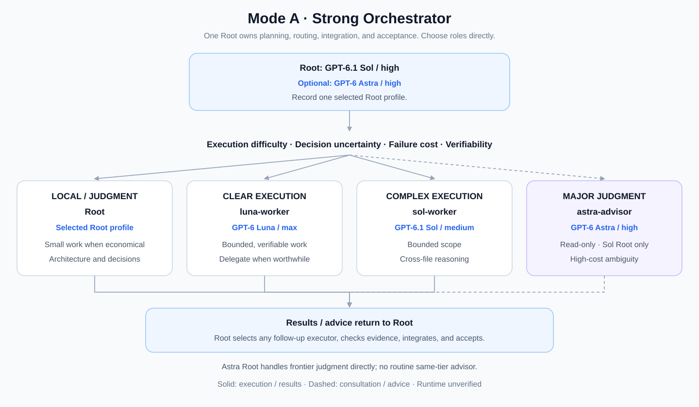
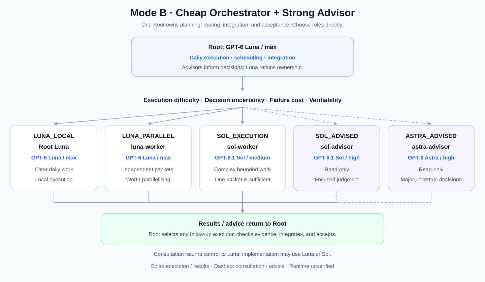

# Codex Model Routing

**简体中文** | [English](README.en.md)

一套面向 Codex App / Codex multi-agent 的 **Model-Aware Orchestration** 研究、实验与可复用配置。

## 为什么做这个项目

这个仓库并不是为了简单比较“哪个模型更强”，也不是为了让所有任务都默认使用最强模型。

真正想解决的问题是：

> **在有限的 Token、额度和推理预算下，如何把不同类型的工作交给最合适、最具性价比的模型，让每一种模型主要做自己更擅长的事情，从而提升单位 Token 的工程产出。**

大模型之间并不只有“强”和“弱”的区别。不同模型在任务理解、架构判断、复杂推理、代码执行、检索、测试、机械修改、并行工作等方面，往往有不同的能力特点与成本结构。

如果所有工作都交给高成本模型，虽然简单，但会快速消耗有限 Token；如果一味追求低成本，又可能因为错误判断、返工和上下文损失，最终付出更高代价。

因此，本项目尝试研究更细粒度的 **Model Routing / Model Division of Labor**：

- 让高性价比模型承担边界清晰、可验证、执行型的工作；
- 让更强的推理模型集中处理架构、歧义、高风险判断和复杂 root cause；
- 根据 cognitive complexity、ambiguity、risk、blast radius、reversibility、verifiability 等因素动态选择执行主体；
- 尽量减少“强模型做机械工作”和“弱模型处理高风险决策”两种浪费；
- 在保证工程质量的同时，提高有限 Token 的利用效率。

另一个重要原则是：**不破坏用户已经形成的 Root 模型使用习惯。**

有人习惯使用 Sol High 作为主线程，希望它持续掌握规划、架构和最终验收；也有人更愿意使用 Luna Max 作为日常主线程，只在真正需要高级判断时咨询 Sol 或 Astra。

所以这个仓库不是试图规定唯一正确的 Root 模型，而是尝试回答：

> **在保持用户 Root 模型习惯不变的前提下，怎样通过 `AGENTS.md` 的 orchestration policy 和 Custom Agents，让不同模型形成更高效的分工？**

## 两种模式 · GPT-6 迁移基线

保留两种 Root 使用习惯。四个角色的模型/effort 已完成一次实际调用核验；顾问有效权限仍不匹配，完整路由流程尚待验证。旧版 GPT-5.6 的实践结果不能代替新版证据。

### Mode A — Strong Orchestrator



默认 **GPT-6.1 Sol / high 作为 Root**，也支持用户明确选择 **GPT-6 Astra / high Root**：

- Root 能可靠执行并验证，且本地执行更经济或已具充分上下文 → Root；
- 清晰、bounded、可验证且值得委派的执行 → `luna-worker` / GPT-6 Luna / max；
- 目标明确但需要跨文件推理、复杂调试的执行 → `sol-worker` / GPT-6.1 Sol / medium；
- 需求、架构、路由、集成和最终验收 → Root；
- Sol Root 经调查仍无法可靠解决的重大判断，或高失败代价且歧义显著的决策 → `astra-advisor` / GPT-6 Astra / high，只读咨询。

Astra Root 自己处理最高难度判断，不例行再调用 Astra 顾问。`sol-advisor` 在本模式不默认使用，仅在用户明确要求独立咨询时调用。

### Mode B — Cheap Orchestrator + Strong Advisor



保留 **GPT-6 Luna / max 作为 Root**：

- `LUNA_LOCAL`：日常工作由 Luna 自行执行和验证；
- `LUNA_PARALLEL`：独立、值得并行的明确任务 → `luna-worker`；
- `SOL_EXECUTION`：目标和范围明确，但实现超出 Luna 的可靠能力 → `sol-worker`；
- `SOL_ADVISED`：需要较强判断的局部设计、兼容性取舍或根因分析 → `sol-advisor`，只读；
- `ASTRA_ADVISED`：高失败代价且歧义显著、跨系统重大取舍，或 Sol 咨询后仍未解决的重大判断 → `astra-advisor`，只读。

顾问意见返回 Luna，由 Luna 选择自己或适合的 worker 实现；Luna 保留调度、集成和最终验收责任。Sol worker 可以执行单个独立任务，不要求先咨询或先形成并行任务。

两种模式都允许 Root 直接选择合适层级，无需逐级经过所有模型。缺少权限、工具或用户事实应先解决对应阻塞；升级模型不能补齐这些缺失。

模型与 reasoning 分别配置。上述档位是迁移起点，尚未证实最优。任务质量、耗时、Token 和返工成本需通过代表性任务比较。官方模型定位见 [GPT-6 指南](https://developers.openai.com/api/docs/guides/latest-model)（2026-10-03 核对）；具体分工是本项目的设计建议。

---

# 快速开始

第一次使用只需要在下面两种方式中选一种。

## 方式 A — 让 Codex 自动安装（推荐）

进入你真正要开发的项目目录，然后根据自己的 Root 使用习惯，把对应的 **Setup Prompt URL** 交给 Codex。

### Strong Orchestrator — Sol High / 可选 Astra High Root

把下面这段直接发给 Codex：

```text
请先完整读取并严格执行下面的 Setup Prompt：
https://raw.githubusercontent.com/yandw/codex-model-routing/main/prompts/setup-strong-orchestrator.prompt.md

将它视为本次 Codex Model Routing 安装与当前项目初始化的完整指令。
不要省略其中的 Agent 安装、AGENTS.md routing 和验证步骤。
如果无法读取该 URL，请停止并报告网络访问失败，不要猜测 Prompt 内容。
```

### Cheap Orchestrator + Strong Advisor — Luna Max Root

把下面这段直接发给 Codex：

```text
请先完整读取并严格执行下面的 Setup Prompt：
https://raw.githubusercontent.com/yandw/codex-model-routing/main/prompts/setup-luna-first-advisor.prompt.md

将它视为本次 Codex Model Routing 安装与当前项目初始化的完整指令。
不要省略其中的 Agent 安装、AGENTS.md routing 和验证步骤。
如果无法读取该 URL，请停止并报告网络访问失败，不要猜测 Prompt 内容。
```

Setup Prompt 会一次完成：

```text
读取官方 Setup Prompt
        ↓
安装 / 更新 ~/.codex/agents/ 中四个 Custom Agents
        ↓
读取当前项目已有 AGENTS.md
        ↓
应用你选择的 routing mode
        ↓
保留无冲突的 Skills / worktree / TDD / testing / review / Git workflow
        ↓
校验安装、routing architecture 和能够读取到的 runtime evidence
```

**这是推荐的第一次安装方式。** 后续 Setup Prompt 更新后，新用户只要继续使用同一个 Raw URL，就会读取最新版本。

> Codex 需要能够访问公开 GitHub / Raw URL。如果当前运行环境禁止网络访问，请使用下面的 Manual 方式。

## 方式 B — Manual

Manual 方式分两步：**手动安装 Agent → 在自己的项目里启用一种 routing mode。**

### 1. 手动安装四个 Agent

Clone 本仓库后执行：

```bash
git clone https://github.com/yandw/codex-model-routing.git
cd codex-model-routing
mkdir -p ~/.codex/agents
cp .codex/agents/*.toml ~/.codex/agents/
```

最终应该得到：

```text
~/.codex/agents/
├── luna-worker.toml
├── sol-worker.toml
├── sol-advisor.toml
└── astra-advisor.toml
```

不要安装成：

```text
~/.codex/agents/agents/luna-worker.toml
```

### 2. 在自己的项目里启用 routing mode

进入目标项目：

```bash
cd /path/to/your-project
```

然后选择一份 **AGENTS-only Prompt** 交给 Codex。它只负责当前项目的 `AGENTS.md` routing layer，不再安装全局 Agent。

| Root 使用习惯 | 模式 | 中文 Prompt | English |
|---|---|---|---|
| Sol High / Astra High 做主线程 | Strong Orchestrator | [`AGENTS.md Prompt`](prompts/strong-orchestrator-agents-md.prompt.md) | [`English`](prompts/en/strong-orchestrator-agents-md.prompt.md) |
| Luna Max 做主线程 | Cheap Orchestrator + Strong Advisor | [`AGENTS.md Prompt`](prompts/luna-first-advisor-agents-md.prompt.md) | [`English`](prompts/en/luna-first-advisor-agents-md.prompt.md) |

如果 Codex 可以访问公开 URL，也可以让它直接读取对应的 Raw AGENTS-only Prompt；如果不能，就打开文件并把内容复制给 Codex。

---

# 四个 Agent 分别是干什么的？

`AGENTS.md` 决定何时调用角色；TOML 决定角色的模型、推理档位、权限和行为。

| Agent | 模型 / Reasoning | 权限 | 职责与模式 |
|---|---|---|---|
| [`luna-worker`](.codex/agents/luna-worker.toml) | `gpt-6-luna / max` | workspace-write | 明确、可验证的执行；两种模式共用 |
| [`sol-worker`](.codex/agents/sol-worker.toml) | `gpt-6.1-sol / medium` | workspace-write | 边界明确但需要较强推理的执行；两种模式共用 |
| [`sol-advisor`](.codex/agents/sol-advisor.toml) | `gpt-6.1-sol / high` | **read-only** | 局部设计、兼容性取舍、复杂根因判断；Mode B 按需咨询，Mode A 仅用户明确要求时使用 |
| [`astra-advisor`](.codex/agents/astra-advisor.toml) | `gpt-6-astra / high` | **read-only** | 高代价、高歧义或重大跨系统决策；Mode A 的 Sol Root 与 Mode B 按需咨询 |

四个角色组成共享 Agent Pool，不要求每次任务都调用。Worker 和 advisor 均将升级问题返回 Root，不自行创建其他 agent。Advisor 的意见不能代替实际验证。

## Effort 与权限兼容性

角色 effort 是 TOML 中的固定基线。调整时需同步 TOML、项目映射和验证预期，重新加载后核对实际元数据。Custom Agent 文件里的模型/effort 优先于调用参数；本版不承诺按任务动态切换 effort。当前接口使用 `agent_type` 和 `fork_turns="none"`，不同时传入冲突的模型/effort 覆盖值。客户端没有角色选择入口时，仅安装文件不能验证这套架构。

表中 Advisor 的 `read-only` 是所需沙箱，不代表每种宿主都已强制执行。父会话的实时权限可能覆盖角色默认值。实质咨询前先做无工具握手，验证有效 sandbox/approval 元数据；不匹配或缺少证据时停止该咨询。可在独立只读环境/会话中继续验证，不自动更改全局权限。外部连接器权限与 Shell 沙箱也需区分。参见[官方子 Agent 配置](https://learn.chatgpt.com/docs/agent-configuration/subagents)和[运行时验证指南](docs/runtime-verification.md)。

## 已安装用户如何升级

重新执行所选模式的 Setup Prompt。四个 TOML 和项目 routing section 需要一起更新，单独替换模型名会残留旧路由规则。手动覆盖已有 Agent 文件前先备份。

Mode A 新增可选 Astra Root profile，以及 Sol Root 的 Astra 咨询路径。Mode B 移除旧版禁用 `sol-worker` 的规则，咨询后的实现由 Root 交给适合的执行者。保留一个 architecture marker 和一个选定 Root profile，分别验证角色注册和实际 runtime。

Raw Setup URL 指向 GitHub `main` 已发布版本。本地修改不会更新这些 URL；尚未发布的 checkout 应使用本地 Agent 文件和本地 AGENTS-only Prompt。

## 三层配置分别控制什么？

```text
Codex App / .codex/config.toml
        ↓
你当前 Root / Primary 默认用什么模型

~/.codex/agents/*.toml
        ↓
有哪些可调用角色；每个角色的 model / reasoning / permission / behavior

<project>/AGENTS.md
        ↓
当前项目什么时候调用哪个角色，以及 escalation / integration / acceptance 规则
```

这也是为什么**只安装 TOML 不够**，也为什么**只写 AGENTS.md 也不够**：两层需要一起工作。

---

# 如何确认 Model Routing 真的生效？

分开检查三个层面：仓库配置、当前会话已注册角色、实际运行证据。磁盘 TOML 更新不代表当前会话已经重新加载，更不代表子 agent 已按预期运行。

| Role | 预期模型 | Reasoning |
|---|---|---|
| `luna-worker` | `gpt-6-luna` | `max` |
| `sol-worker` | `gpt-6.1-sol` | `medium` |
| `sol-advisor` | `gpt-6.1-sol` | `high` |
| `astra-advisor` | `gpt-6-astra` | `high` |

Root 也需匹配选定 profile：Mode A 默认 `gpt-6.1-sol / high`，可选 `gpt-6-astra / high`；Mode B 默认 `gpt-6-luna / max`。用户明确选择的其他受支持 reasoning 应记录为自定义 profile。

安装后如果当前会话缺少角色或显示旧映射，按客户端要求重新加载/开启会话，再核对角色和实际 runtime。提示词不能切换当前线程的模型；发现 mismatch 应报告，不自动修改全局配置或静默回退。

新版状态：**完整流程未验证；顾问权限受限**。四个角色的模型/effort 核验结果及修正见[本轮验证记录](docs/verification/gpt6-routing-smoke.md)。只有实际调用过且有对应 session / Agent Activity 证据的角色才可标为已验证。完整方法与迁移验收场景见 [`docs/runtime-verification.md`](docs/runtime-verification.md)。

---

# 为什么这样设计？

这些规则不是为了增加流程，而是为了避免 Model Routing 最常见的几种浪费。

### 1. Optimize for useful work per Token

优化目标不是“每次调用最便宜”，而是**单位 Token 最终完成多少正确、可验收的工程工作**。低价模型导致大量返工同样是浪费。

### 2. Use the cheapest capable model

只要任务风险、歧义和 reasoning demand 允许，就把它交给更具性价比的模型；真正昂贵的推理能力留给真正困难的决策。

### 3. Difficulty ≠ Size

1000 行机械修改可能非常适合 Luna；10 行 authentication / migration 代码却可能必须由高 reasoning 模型判断。文件数和代码量不是 routing 标准。

### 4. Route by cognitive complexity

主要看 ambiguity、solution-path uncertainty、blast radius、reversibility、risk、verifiability，而不是简单看“任务大不大”。

### 5. Preserve the user's Root habit

Model Routing 应该增强你的工作习惯，而不是强迫所有人都使用同一个 Root。两种模式分别保留强主线程（Sol 或 Astra）和 Luna-root 的使用方式。

### 6. Bounded task packet first

越希望把执行交给高性价比 worker，就越需要明确 objective、scope、writable files、acceptance criteria 和 validation。清晰边界是低成本委派仍然可靠的前提。

### 7. Worker completion ≠ task completion

Worker 完成的是自己的 packet，不代表整个任务已经完成。integration、conflict resolution 和 final acceptance 仍由当前模式定义的 owner 负责。

### 8. No recursive agent tree by default

Worker 不应自行不断 spawn / 升级其他 Agent。Model Routing 权限保持集中，才能控制成本、职责和上下文扩散。

### 9. Runtime metadata is the source of truth

静态配置只是 intent。要研究模型分工是否真的更高效，最终必须看谁实际运行、用了什么 model / reasoning、完成质量和返工情况。

---

## Research lineage / Inspirations

这项整理主要受到两组公开实践的启发：

- **Vox / `@Voxyz_ai`**：启发了“强主线程负责判断与规划、把边界明确的执行工作交给 Luna Max”的思路。Strong Orchestrator 进一步加入 Sol Medium，处理 reasoning-heavy but bounded execution。
- **BruceLanLan / `sol-luna-engineering-workflow`**：提供了更完整的 Luna-first + Sol Advisor 范式，包括 Luna primary、parallel Luna workers、read-only Sol High advisor、task packet、file ownership、escalation gates，以及 runtime evidence 才是模型实际调用事实来源等原则。

本仓库是在这些思路基础上的**整理、抽象、验证与扩展**，目标不是复刻某一个实现，而是持续探索不同模型之间更有效的工程分工。

参考：

- Vox / `@Voxyz_ai`: https://x.com/Voxyz_ai/status/2083583538830410127
- `@Lonely__MH`: https://x.com/Lonely__MH/status/2083762211449684344
- BruceLanLan / sol-luna-engineering-workflow: https://github.com/BruceLanLan/sol-luna-engineering-workflow

## Repository Structure

```text
.
├── README.md
├── README.en.md
├── .codex/
│   └── agents/
│       ├── luna-worker.toml
│       ├── sol-worker.toml
│       ├── sol-advisor.toml
│       └── astra-advisor.toml
├── scripts/
│   └── verify_runtime.py
├── tests/
│   └── test_verify_runtime.py
├── docs/
│   ├── diagrams/
│   ├── mode-selection.md
│   ├── research-notes.md
│   ├── runtime-verification.md
│   └── task-packet-template.md
└── prompts/
    ├── setup-strong-orchestrator.prompt.md
    ├── setup-luna-first-advisor.prompt.md
    ├── strong-orchestrator-agents-md.prompt.md
    ├── luna-first-advisor-agents-md.prompt.md
    └── en/
        ├── setup-strong-orchestrator.prompt.md
        ├── setup-luna-first-advisor.prompt.md
        ├── strong-orchestrator-agents-md.prompt.md
        └── luna-first-advisor-agents-md.prompt.md
```

## Star & Fork

如果这个项目对你的 Codex / multi-agent 工作流有帮助，欢迎给仓库一个 **Star**，让更多人看到这种基于模型分工而不是单模型硬扛的工程方式。

也非常欢迎 **Fork** 本仓库，尝试你自己的模型组合、Agent 角色、routing policy、Task Packet 或 escalation rule。不同任务类型、不同模型版本和不同工程习惯，很可能会得到不同的最优分工。

如果你验证出了更高效的 routing 方式，也欢迎把 runtime evidence、实验结论或改进思路带回来交流。这个仓库的目标不是给出一次性的“标准答案”，而是持续寻找 **更高的工程产出 / Token**。

## Status

GPT-6 迁移基线（2026-10-03）：路由设计与配置已更新；四角色模型/effort 已核验，顾问有效沙箱不匹配，完整流程、质量与效率仍待验证。原 GPT-5.6 实践属于历史背景，不能证明此版本已验证。推理档位需要代表性任务评估。
